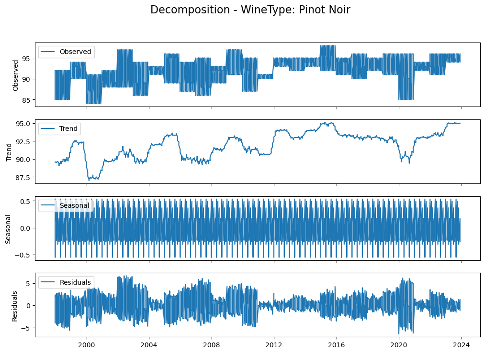
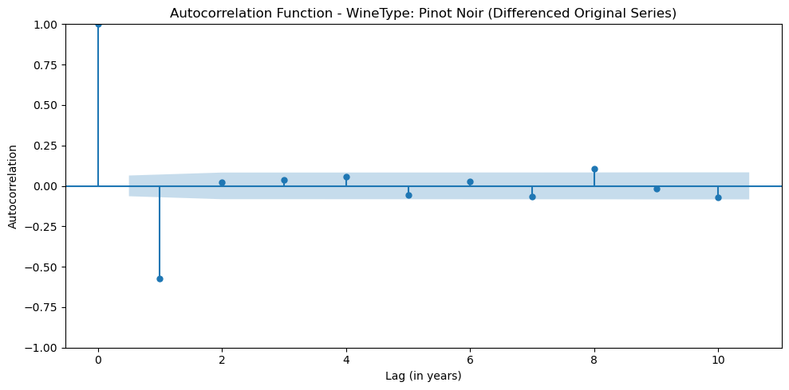
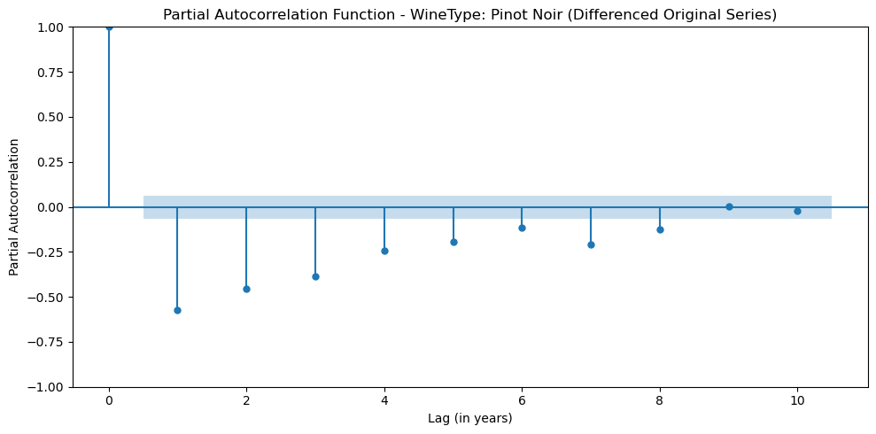
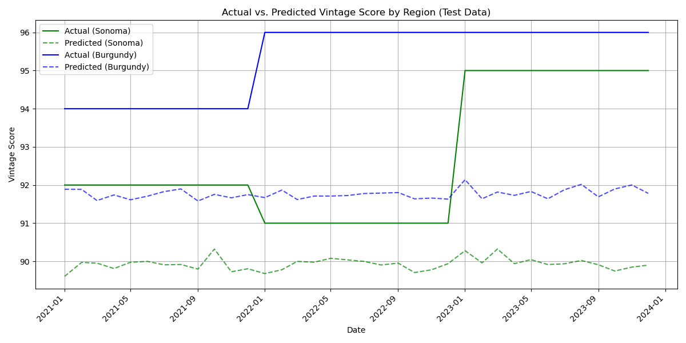
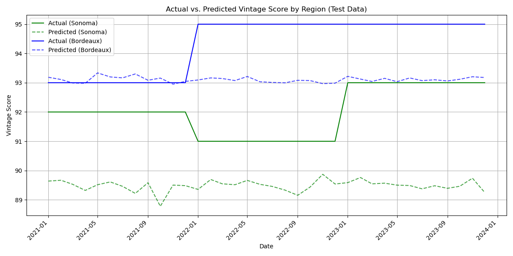

## Forecasting and Analyzing Wine Vintage Scores Part 2

[Return to Part 1](/projects/wine)
 
[Go to Part 3 Important Features](/pages/wine-part3)

# Forecasting

Since my goal is to see if weather can be used to predict wine vintage scores, there are various modeling approaches available. In this project, I'm going to opt for time series models due to the nature of the data (i.e. the yearly and seasonly weather pattern/cycles). I'll split the data into 2 parts: training and test. Since this is time series data, I'll have to make sure that the split doesn't overlap any time, so the training data will be 1997 to 2020 and the test data will be 2021 to 2023.

 

In addition to time series components, I'll focus on key weather features selected to predict VintageScore. This selection process was based on the correlation heatmap on the previous page. To create a representative set of predictors covering different weather aspects, my approach was to choose the single feature with the highest absolute correlation coefficient within each main weather category (temperature, wind speed, visibility, snow depth). For example, MaxMonthTempHigh was selected using this criterion to represent temperature effects. I did make some exceptions however. For precipitation, both the frequency of rainy days (DaysRainMonth) and the maximum precipitation amount for a given month (MaxMonthPrecip) were included. Similarly, for atmospheric pressure, both AvgMonthMaxPressure and MinMonthMinPressure were included as all these features demonstrated significant correlations with VintageScore. This resulted in a curated set of weather features used for modeling.

### Pinot Noir

To simplify the initial time series modeling, I'll focus on analyzing a single wine type for now: Pinot Noir (because it's my favorite grape). Additionally, I'll filter for Pinot Noir vintage scores in the Northern Hemisphere. This is to avoid the complexity related to differing agricultural cycles (Southern Hemisphere seasons are flipped so the growing/harvesting periods are different). A crucial preliminary step in times series modeling is to assess the stationarity of the dependent variable, or whether the basic statistical properties do not change over time. This means that VintageScore should have constant mean and variance. We can visually inspect this by looking at whether there is a clear upward/downward trend line and whether there is seasonality cycles.  

 

    

 

Based on the decomposition, we can see that there could be a long term trend, but it's hard to say. We definitely see seasonality patterns though. The next step after visual decomposition is to run a statistical test to check for stationarity, which is the ADF test.

 
ADF Test for WineType: Pinot Noir (Original Series)
 
ADF Statistic: -2.8083829632432664
 
p-value: 0.057086262941437045
 
Critical Values: {'1%': -3.437423894618058, '5%': -2.864662884591462, '10%': -2.5684328157550835}
 
VintageScore is likely non-stationary for this group (Original Series).

 

The test suggests that VintageScore is likely non-stationary, and so would require some differencing (i.e. subtracting VintageScore with its lagged self) when applying time series modeling. 

  

The next step is to identify the underlying temporal structure of VintageScore. In other words, we want to understand how the score in a given year relates to scores in previous years. The standard way to do this is to look at the Autocorrelation Function (ACF) and Partial Autocorrelation Function (PACF) plots. 
- The ACF plot visualizes the correlation between the time series and lagged versions of itself at different time lags (k). It represents the total correlation between the observation at time t and the observation at time t-k. *Looking at the ACF plot helps us pick the q parameter in time series modeling. This q parameter is called the MA or moving average and represents the number of past forecast errors or random shocks that need to be accounted for.*
- The PACF plot visualizes the partial or direct correlation between the observation at time t and the observation at time t-k after controlling for the effects of the correlations in between. *Looking at the PACF plot helps us pick the p parameter, which is called AR or autoregressive and represents the number of past observations that are considered in the time series modeling.*

  

    

 

Based on the ACF plot, it seems like there is a significant spike at lag 1, so it may suggest that the Moving Average parameter, q, is 1. 

 

    

 

Based on the PACF plot, it seems like there is a significant spike at lag 5 and 7, so it may suggest that the Autoregressive parameter, p, is 5 or 7. 

#### ARIMAX

Finally, we can get to the modeling! I'll model VintageScore first using an **ARIMAX** (Autoregressive Integrated Moving Average with eXogenous variables) model. This model structure allows VintageScore to be predicted based on its own past values, past errors and additional weather features. For an ARIMAX model, we need to choose 3 parameters, p, d, and q. Based on the analysis above, We might choose p=5, d=1, and q=1. However, I ran this model and found that the model didn't converge. Instead, I discovered that an ARIMAX (p=1, d=1, and q=1) model converged.

 
<table style="border-collapse: collapse; width: 80%; margin-left: auto; margin-right: auto;">
  <caption style="text-align: center; font-weight: bold;">ARIMA(1, 1, 1) Results</caption>
  <thead style="border: 1px solid black;">
    <tr style="border: 1px solid black;">
      <th style="border: 1px solid black; text-align: center;"></th>
      <th style="border: 1px solid black; text-align: center;">coef</th>
      <th style="border: 1px solid black; text-align: center;">std err</th>
      <th style="border: 1px solid black; text-align: center;">z</th>
      <th style="border: 1px solid black; text-align: center;">P&gt;|z|</th>
      <th style="border: 1px solid black; text-align: center;">[0.025</th>
      <th style="border: 1px solid black; text-align: center;">0.975]</th>
    </tr>
  </thead>
  <tbody style="border: 1px solid black;">
    <tr style="border: 1px solid black;">
      <td style="border: 1px solid black; text-align: center;">AvgMonthWindSpd</td>
      <td style="border: 1px solid black; text-align: center;">0.2798</td>
      <td style="border: 1px solid black; text-align: center;">0.158</td>
      <td style="border: 1px solid black; text-align: center;">1.776</td>
      <td style="border: 1px solid black; text-align: center;">0.076</td>
      <td style="border: 1px solid black; text-align: center;">-0.029</td>
      <td style="border: 1px solid black; text-align: center;">0.589</td>
    </tr>
    <tr style="border: 1px solid black;">
      <td style="border: 1px solid black; text-align: center;">MaxMonthDewHigh</td>
      <td style="border: 1px solid black; text-align: center;">0.2642</td>
      <td style="border: 1px solid black; text-align: center;">0.209</td>
      <td style="border: 1px solid black; text-align: center;">1.265</td>
      <td style="border: 1px solid black; text-align: center;">0.206</td>
      <td style="border: 1px solid black; text-align: center;">-0.145</td>
      <td style="border: 1px solid black; text-align: center;">0.674</td>
    </tr>
    <tr style="border: 1px solid black;">
      <td style="border: 1px solid black; text-align: center;">AvgMonthMaxPressure</td>
      <td style="border: 1px solid black; text-align: center;">0.2483</td>
      <td style="border: 1px solid black; text-align: center;">0.318</td>
      <td style="border: 1px solid black; text-align: center;">0.782</td>
      <td style="border: 1px solid black; text-align: center;">0.434</td>
      <td style="border: 1px solid black; text-align: center;">-0.374</td>
      <td style="border: 1px solid black; text-align: center;">0.871</td>
    </tr>
    <tr style="border: 1px solid black;">
      <td style="border: 1px solid black; text-align: center;">MaxMonthPrecip</td>
      <td style="border: 1px solid black; text-align: center;">0.0266</td>
      <td style="border: 1px solid black; text-align: center;">0.113</td>
      <td style="border: 1px solid black; text-align: center;">0.236</td>
      <td style="border: 1px solid black; text-align: center;">0.813</td>
      <td style="border: 1px solid black; text-align: center;">-0.194</td>
      <td style="border: 1px solid black; text-align: center;">0.247</td>
    </tr>
    <tr style="border: 1px solid black;">
      <td style="border: 1px solid black; text-align: center;">MinMonthMinPressure</td>
      <td style="border: 1px solid black; text-align: center;">-0.7424</td>
      <td style="border: 1px solid black; text-align: center;">0.983</td>
      <td style="border: 1px solid black; text-align: center;">-0.755</td>
      <td style="border: 1px solid black; text-align: center;">0.450</td>
      <td style="border: 1px solid black; text-align: center;">-2.670</td>
      <td style="border: 1px solid black; text-align: center;">1.185</td>
    </tr>
    <tr style="border: 1px solid black;">
      <td style="border: 1px solid black; text-align: center;">SumMonthSnowDepth</td>
      <td style="border: 1px solid black; text-align: center;">2.1032</td>
      <td style="border: 1px solid black; text-align: center;">1.065</td>
      <td style="border: 1px solid black; text-align: center;">1.975</td>
      <td style="border: 1px solid black; text-align: center;">0.048</td>
      <td style="border: 1px solid black; text-align: center;">0.016</td>
      <td style="border: 1px solid black; text-align: center;">4.190</td>
    </tr>
    <tr style="border: 1px solid black;">
      <td style="border: 1px solid black; text-align: center;">MaxMonthTempHigh</td>
      <td style="border: 1px solid black; text-align: center;">0.0255</td>
      <td style="border: 1px solid black; text-align: center;">0.179</td>
      <td style="border: 1px solid black; text-align: center;">0.143</td>
      <td style="border: 1px solid black; text-align: center;">0.886</td>
      <td style="border: 1px solid black; text-align: center;">-0.325</td>
      <td style="border: 1px solid black; text-align: center;">0.376</td>
    </tr>
    <tr style="border: 1px solid black;">
      <td style="border: 1px solid black; text-align: center;">AvgMonthVis</td>
      <td style="border: 1px solid black; text-align: center;">-0.2104</td>
      <td style="border: 1px solid black; text-align: center;">0.162</td>
      <td style="border: 1px solid black; text-align: center;">-1.300</td>
      <td style="border: 1px solid black; text-align: center;">0.194</td>
      <td style="border: 1px solid black; text-align: center;">-0.527</td>
      <td style="border: 1px solid black; text-align: center;">0.107</td>
    </tr>
    <tr style="border: 1px solid black;">
      <td style="border: 1px solid black; text-align: center;">DaysRainMonth</td>
      <td style="border: 1px solid black; text-align: center;">-0.0028</td>
      <td style="border: 1px solid black; text-align: center;">0.117</td>
      <td style="border: 1px solid black; text-align: center;">-0.024</td>
      <td style="border: 1px solid black; text-align: center;">0.981</td>
      <td style="border: 1px solid black; text-align: center;">-0.233</td>
      <td style="border: 1px solid black; text-align: center;">0.227</td>
    </tr>
    <tr style="border: 1px solid black;">
      <td style="border: 1px solid black; text-align: center;">RegionTag_KSTS</td>
      <td style="border: 1px solid black; text-align: center;">0.5794</td>
      <td style="border: 1px solid black; text-align: center;">0.266</td>
      <td style="border: 1px solid black; text-align: center;">2.176</td>
      <td style="border: 1px solid black; text-align: center;">0.030</td>
      <td style="border: 1px solid black; text-align: center;">0.058</td>
      <td style="border: 1px solid black; text-align: center;">1.101</td>
    </tr>
    <tr style="border: 1px solid black;">
      <td style="border: 1px solid black; text-align: center;">RegionTag_LFSD</td>
      <td style="border: 1px solid black; text-align: center;">1.9893</td>
      <td style="border: 1px solid black; text-align: center;">0.315</td>
      <td style="border: 1px solid black; text-align: center;">6.319</td>
      <td style="border: 1px solid black; text-align: center;">0.000</td>
      <td style="border: 1px solid black; text-align: center;">1.372</td>
      <td style="border: 1px solid black; text-align: center;">2.606</td>
    </tr>
    <tr style="border: 1px solid black;">
      <td style="border: 1px solid black; text-align: center;">ar.L1</td>
      <td style="border: 1px solid black; text-align: center;">-0.3001</td>
      <td style="border: 1px solid black; text-align: center;">0.035</td>
      <td style="border: 1px solid black; text-align: center;">-8.455</td>
      <td style="border: 1px solid black; text-align: center;">0.000</td>
      <td style="border: 1px solid black; text-align: center;">-0.370</td>
      <td style="border: 1px solid black; text-align: center;">-0.231</td>
    </tr>
    <tr style="border: 1px solid black;">
      <td style="border: 1px solid black; text-align: center;">ma.L1</td>
      <td style="border: 1px solid black; text-align: center;">-0.8730</td>
      <td style="border: 1px solid black; text-align: center;">0.017</td>
      <td style="border: 1px solid black; text-align: center;">-51.616</td>
      <td style="border: 1px solid black; text-align: center;">0.000</td>
      <td style="border: 1px solid black; text-align: center;">-0.906</td>
      <td style="border: 1px solid black; text-align: center;">-0.840</td>
    </tr>
    <tr style="border: 1px solid black;">
      <td style="border: 1px solid black; text-align: center;">sigma2</td>
      <td style="border: 1px solid black; text-align: center;">6.4129</td>
      <td style="border: 1px solid black; text-align: center;">0.346</td>
      <td style="border: 1px solid black; text-align: center;">18.539</td>
      <td style="border: 1px solid black; text-align: center;">0.000</td>
      <td style="border: 1px solid black; text-align: center;">5.735</td>
      <td style="border: 1px solid black; text-align: center;">7.091</td>
    </tr>
  </tbody>
</table>
 

How do we interpret the results? Let's first start by evaluating how the model performed. We'll look at the metrics at the bottom. 
- First, the Ljung-Box test checks for remaining autocorrelation in the residuals. Since the p-value, 0.13, is greater than 0.05, we fail to reject the null hypothesis of no autocorrelation so this checks the box.
- Next, the Jarque-Bera test evaluates the normality of the residuals. Since the p-value is 0.55, we also fail to reject the null hypothesis that the residuals are normally distributed, which also checks the box.
- Then, the test for heteroskedasticity examines whether the variance of the residuals is constant. The corresponding p-value is less than 0.05, which means that we reject the null hypothesis of homoscedasticity and conclude that the residual variance changes over time. This isn't a good sign.

 

Let's interpret the coefficients to see what effects weather has on vintage scores. 
- To no surprise, region plays a large role in determining vintage scores, as confirmed by the significant coefficients for the regional dummy variables (reference level for region is Wilamette Valley; KSTS represents Sonoma County and LFSD represents Burgundy).
- After controlling for region, we can see two weather variables that are still significant or marginally significant in terms of their effect on vintage scores: *AvgMonthWindSpd* and *SumMonthSnowDepth*.
- **AvgMonthWindSpd* is the monthly wind speed average in mph and it shows a positive coefficient and is marginally significant (p=0.076). This suggests that higher average wind speeds might be beneficial, potentially by aiding vine drying and reducing disease risk. More statistically significant (p=0.048) is
- **SumMonthSnowDepth*, which is the monthly average of the total snow amount in inches. Counter-intuitively it also has a positive coefficient, meaning that greater snow accumulation is associated with higher vintage scores. Why? No idea but my best guess after some research is that snow possibly insulates the vines against severe winter cold, acting as a valuable protector and a source of spring moisture upon melting.

 

Although heteroskedasticity was detected in the model residuals, it's also crucial to evaluate the model's predictive capability on the test data. I applied the ARIMAX(1,1,1) model and assessed prediction accuracy using two standard metrics: Root Mean Squared Error (RMSE) and Mean Absolute Percentage Error (MAPE). The results indicated a decent performance, with an RMSE of 3.60 and a MAPE of 4.0%. Since RMSE is measured in the same units as the dependent variable (VintageScore), an average error of 3.60 points suggests a good level of predictive accuracy given the typical scale of vintage scores. The low MAPE of 4% further reinforces high predictive accuracy. However, we should always be cautious that maybe my model is overfitting to some degree. To visually illustrate this performance, the following plot compares the actual VintageScore values against the model's predictions for the test period.

 

    

 

#### SARIMAX 

To account for potential yearly cycles, I'll use a **Seasonal ARIMAX (SARIMAX)** model, which extends the ARIMAX framework by adding specific parameters to handle seasonality. The parameters of SARIMAX are similar to ARIMAX but with the addition of seasonal orders P (seasonal AR), D (seasonal differencing), and Q (seasonal MA), along with the seasonal period S. I would choose S=12 because of the natural annual weather cycle and choose D=1 to reflect seasonal differencing (D=1). After testing various combinations, the setting of SARIMAX (p=4, d=0, q=0, P=0, D=1, Q=0, S=12) was the only model that converged. 

 
<table style="border-collapse: collapse; width: 80%; margin-left: auto; margin-right: auto;">
  <caption style="text-align: center; font-weight: bold;">SARIMAX(4, 0, 0)x(0, 1, 0, 12) Results</caption>
  <thead style="border: 1px solid black;">
    <tr style="border: 1px solid black;">
      <th style="border: 1px solid black; text-align: center;"></th>
      <th style="border: 1px solid black; text-align: center;">coef</th>
      <th style="border: 1px solid black; text-align: center;">std err</th>
      <th style="border: 1px solid black; text-align: center;">z</th>
      <th style="border: 1px solid black; text-align: center;">P&gt;|z|</th>
      <th style="border: 1px solid black; text-align: center;">[0.025</th>
      <th style="border: 1px solid black; text-align: center;">0.975]</th>
    </tr>
  </thead>
  <tbody style="border: 1px solid black;">
    <tr style="border: 1px solid black;">
      <td style="border: 1px solid black; text-align: center;">AvgMonthWindSpd</td>
      <td style="border: 1px solid black; text-align: center;">0.2359</td>
      <td style="border: 1px solid black; text-align: center;">0.156</td>
      <td style="border: 1px solid black; text-align: center;">1.514</td>
      <td style="border: 1px solid black; text-align: center;">0.130</td>
      <td style="border: 1px solid black; text-align: center;">-0.069</td>
      <td style="border: 1px solid black; text-align: center;">0.541</td>
    </tr>
    <tr style="border: 1px solid black;">
      <td style="border: 1px solid black; text-align: center;">MaxMonthDewHigh</td>
      <td style="border: 1px solid black; text-align: center;">-0.0794</td>
      <td style="border: 1px solid black; text-align: center;">0.204</td>
      <td style="border: 1px solid black; text-align: center;">-0.389</td>
      <td style="border: 1px solid black; text-align: center;">0.697</td>
      <td style="border: 1px solid black; text-align: center;">-0.479</td>
      <td style="border: 1px solid black; text-align: center;">0.320</td>
    </tr>
    <tr style="border: 1px solid black;">
      <td style="border: 1px solid black; text-align: center;">AvgMonthMaxPressure</td>
      <td style="border: 1px solid black; text-align: center;">0.3548</td>
      <td style="border: 1px solid black; text-align: center;">0.296</td>
      <td style="border: 1px solid black; text-align: center;">1.198</td>
      <td style="border: 1px solid black; text-align: center;">0.231</td>
      <td style="border: 1px solid black; text-align: center;">-0.226</td>
      <td style="border: 1px solid black; text-align: center;">0.935</td>
    </tr>
    <tr style="border: 1px solid black;">
      <td style="border: 1px solid black; text-align: center;">MaxMonthPrecip</td>
      <td style="border: 1px solid black; text-align: center;">0.0957</td>
      <td style="border: 1px solid black; text-align: center;">0.106</td>
      <td style="border: 1px solid black; text-align: center;">0.907</td>
      <td style="border: 1px solid black; text-align: center;">0.364</td>
      <td style="border: 1px solid black; text-align: center;">-0.111</td>
      <td style="border: 1px solid black; text-align: center;">0.303</td>
    </tr>
    <tr style="border: 1px solid black;">
      <td style="border: 1px solid black; text-align: center;">MinMonthMinPressure</td>
      <td style="border: 1px solid black; text-align: center;">-0.7425</td>
      <td style="border: 1px solid black; text-align: center;">0.956</td>
      <td style="border: 1px solid black; text-align: center;">-0.777</td>
      <td style="border: 1px solid black; text-align: center;">0.437</td>
      <td style="border: 1px solid black; text-align: center;">-2.616</td>
      <td style="border: 1px solid black; text-align: center;">1.131</td>
    </tr>
    <tr style="border: 1px solid black;">
      <td style="border: 1px solid black; text-align: center;">SumMonthSnowDepth</td>
      <td style="border: 1px solid black; text-align: center;">1.2342</td>
      <td style="border: 1px solid black; text-align: center;">0.846</td>
      <td style="border: 1px solid black; text-align: center;">1.458</td>
      <td style="border: 1px solid black; text-align: center;">0.145</td>
      <td style="border: 1px solid black; text-align: center;">-0.425</td>
      <td style="border: 1px solid black; text-align: center;">2.893</td>
    </tr>
    <tr style="border: 1px solid black;">
      <td style="border: 1px solid black; text-align: center;">MaxMonthTempHigh</td>
      <td style="border: 1px solid black; text-align: center;">0.2530</td>
      <td style="border: 1px solid black; text-align: center;">0.155</td>
      <td style="border: 1px solid black; text-align: center;">1.629</td>
      <td style="border: 1px solid black; text-align: center;">0.103</td>
      <td style="border: 1px solid black; text-align: center;">-0.051</td>
      <td style="border: 1px solid black; text-align: center;">0.557</td>
    </tr>
    <tr style="border: 1px solid black;">
      <td style="border: 1px solid black; text-align: center;">AvgMonthVis</td>
      <td style="border: 1px solid black; text-align: center;">0.0691</td>
      <td style="border: 1px solid black; text-align: center;">0.144</td>
      <td style="border: 1px solid black; text-align: center;">0.480</td>
      <td style="border: 1px solid black; text-align: center;">0.631</td>
      <td style="border: 1px solid black; text-align: center;">-0.213</td>
      <td style="border: 1px solid black; text-align: center;">0.351</td>
    </tr>
    <tr style="border: 1px solid black;">
      <td style="border: 1px solid black; text-align: center;">DaysRainMonth</td>
      <td style="border: 1px solid black; text-align: center;">-0.0412</td>
      <td style="border: 1px solid black; text-align: center;">0.117</td>
      <td style="border: 1px solid black; text-align: center;">-0.352</td>
      <td style="border: 1px solid black; text-align: center;">0.725</td>
      <td style="border: 1px solid black; text-align: center;">-0.270</td>
      <td style="border: 1px solid black; text-align: center;">0.188</td>
    </tr>
    <tr style="border: 1px solid black;">
      <td style="border: 1px solid black; text-align: center;">RegionTag_KSTS</td>
      <td style="border: 1px solid black; text-align: center;">0.8087</td>
      <td style="border: 1px solid black; text-align: center;">0.244</td>
      <td style="border: 1px solid black; text-align: center;">3.319</td>
      <td style="border: 1px solid black; text-align: center;">0.001</td>
      <td style="border: 1px solid black; text-align: center;">0.331</td>
      <td style="border: 1px solid black; text-align: center;">1.286</td>
    </tr>
    <tr style="border: 1px solid black;">
      <td style="border: 1px solid black; text-align: center;">RegionTag_LFSD</td>
      <td style="border: 1px solid black; text-align: center;">2.1886</td>
      <td style="border: 1px solid black; text-align: center;">0.284</td>
      <td style="border: 1px solid black; text-align: center;">7.703</td>
      <td style="border: 1px solid black; text-align: center;">0.000</td>
      <td style="border: 1px solid black; text-align: center;">1.632</td>
      <td style="border: 1px solid black; text-align: center;">2.746</td>
    </tr>
    <tr style="border: 1px solid black;">
      <td style="border: 1px solid black; text-align: center;">ar.L1</td>
      <td style="border: 1px solid black; text-align: center;">-0.2502</td>
      <td style="border: 1px solid black; text-align: center;">0.030</td>
      <td style="border: 1px solid black; text-align: center;">-8.459</td>
      <td style="border: 1px solid black; text-align: center;">0.000</td>
      <td style="border: 1px solid black; text-align: center;">-0.308</td>
      <td style="border: 1px solid black; text-align: center;">-0.192</td>
    </tr>
    <tr style="border: 1px solid black;">
      <td style="border: 1px solid black; text-align: center;">ar.L2</td>
      <td style="border: 1px solid black; text-align: center;">-0.0391</td>
      <td style="border: 1px solid black; text-align: center;">0.029</td>
      <td style="border: 1px solid black; text-align: center;">-1.329</td>
      <td style="border: 1px solid black; text-align: center;">0.184</td>
      <td style="border: 1px solid black; text-align: center;">-0.097</td>
      <td style="border: 1px solid black; text-align: center;">0.019</td>
    </tr>
    <tr style="border: 1px solid black;">
      <td style="border: 1px solid black; text-align: center;">ar.L3</td>
      <td style="border: 1px solid black; text-align: center;">0.0863</td>
      <td style="border: 1px solid black; text-align: center;">0.030</td>
      <td style="border: 1px solid black; text-align: center;">2.922</td>
      <td style="border: 1px solid black; text-align: center;">0.003</td>
      <td style="border: 1px solid black; text-align: center;">0.028</td>
      <td style="border: 1px solid black; text-align: center;">0.144</td>
    </tr>
    <tr style="border: 1px solid black;">
      <td style="border: 1px solid black; text-align: center;">ar.L4</td>
      <td style="border: 1px solid black; text-align: center;">0.1455</td>
      <td style="border: 1px solid black; text-align: center;">0.033</td>
      <td style="border: 1px solid black; text-align: center;">4.414</td>
      <td style="border: 1px solid black; text-align: center;">0.000</td>
      <td style="border: 1px solid black; text-align: center;">0.081</td>
      <td style="border: 1px solid black; text-align: center;">0.210</td>
    </tr>
    <tr style="border: 1px solid black;">
      <td style="border: 1px solid black; text-align: center;">sigma2</td>
      <td style="border: 1px solid black; text-align: center;">11.2420</td>
      <td style="border: 1px solid black; text-align: center;">0.484</td>
      <td style="border: 1px solid black; text-align: center;">23.236</td>
      <td style="border: 1px solid black; text-align: center;">0.000</td>
      <td style="border: 1px solid black; text-align: center;">10.294</td>
      <td style="border: 1px solid black; text-align: center;">12.190</td>
    </tr>
  </tbody>
</table>
 

Comparing the SARIMAX model results to the previous ARIMAX analysis reveals some key differences. While most of the results are the same, a notable change appeared in the model diagnostics. The JB test became significant for the SARIMAX model, indicating its residuals likely deviate from a normal distribution. Furthermore, the statistical significance of the weather predictors changed. Specifically, AvgMonthWindSpd and SumMonthSnowDepth were no longer statistically significant in this SARIMAX specification. In terms of predictive accuracy on the test set, the SARIMAX model yielded an RMSE of 5.01 and a MAPE of 4.0%. When compared to the ARIMAX performance (RMSE 3.60, MAPE 4.0%), the SARIMAX model demonstrates slightly weaker predictive power. 

### Cabernet Sauvignon

To ensure the findings aren't unique to Pinot Noir, I replicated the entire modeling process using data for Cabernet Sauvignon, my second favorite wine type. For Cabernet Sauvignon, the ARIMAX model once again demonstrated superior predictive accuracy compared to the SARIMAX model, yielding both a lower RMSE (2.00 versus 3.23) and a lower MAPE (2% versus 3%). Consequently, only the results for the more accurate ARIMAX model will be presented.

#### ARIMAX

Based on the data, an ARIMAX (p=1,d=1,q=1) model converged.

 
<table style="border-collapse: collapse; width: 80%; margin-left: auto; margin-right: auto;">
  <caption style="text-align: center; font-weight: bold;">ARIMA(1, 1, 1) Results</caption>
  <thead style="border: 1px solid black;">
    <tr style="border: 1px solid black;">
      <th style="border: 1px solid black; text-align: center;"></th>
      <th style="border: 1px solid black; text-align: center;">coef</th>
      <th style="border: 1px solid black; text-align: center;">std err</th>
      <th style="border: 1px solid black; text-align: center;">z</th>
      <th style="border: 1px solid black; text-align: center;">P&gt;|z|</th>
      <th style="border: 1px solid black; text-align: center;">[0.025</th>
      <th style="border: 1px solid black; text-align: center;">0.975]</th>
    </tr>
  </thead>
  <tbody style="border: 1px solid black;">
    <tr style="border: 1px solid black;">
      <td style="border: 1px solid black; text-align: center;">AvgMonthWindSpd</td>
      <td style="border: 1px solid black; text-align: center;">0.0229</td>
      <td style="border: 1px solid black; text-align: center;">0.179</td>
      <td style="border: 1px solid black; text-align: center;">0.128</td>
      <td style="border: 1px solid black; text-align: center;">0.898</td>
      <td style="border: 1px solid black; text-align: center;">-0.327</td>
      <td style="border: 1px solid black; text-align: center;">0.373</td>
    </tr>
    <tr style="border: 1px solid black;">
      <td style="border: 1px solid black; text-align: center;">MaxMonthDewHigh</td>
      <td style="border: 1px solid black; text-align: center;">0.2841</td>
      <td style="border: 1px solid black; text-align: center;">0.274</td>
      <td style="border: 1px solid black; text-align: center;">1.037</td>
      <td style="border: 1px solid black; text-align: center;">0.300</td>
      <td style="border: 1px solid black; text-align: center;">-0.253</td>
      <td style="border: 1px solid black; text-align: center;">0.821</td>
    </tr>
    <tr style="border: 1px solid black;">
      <td style="border: 1px solid black; text-align: center;">AvgMonthMaxPressure</td>
      <td style="border: 1px solid black; text-align: center;">0.1486</td>
      <td style="border: 1px solid black; text-align: center;">0.385</td>
      <td style="border: 1px solid black; text-align: center;">0.386</td>
      <td style="border: 1px solid black; text-align: center;">0.700</td>
      <td style="border: 1px solid black; text-align: center;">-0.606</td>
      <td style="border: 1px solid black; text-align: center;">0.903</td>
    </tr>
    <tr style="border: 1px solid black;">
      <td style="border: 1px solid black; text-align: center;">MaxMonthPrecip</td>
      <td style="border: 1px solid black; text-align: center;">-0.1055</td>
      <td style="border: 1px solid black; text-align: center;">0.135</td>
      <td style="border: 1px solid black; text-align: center;">-0.782</td>
      <td style="border: 1px solid black; text-align: center;">0.434</td>
      <td style="border: 1px solid black; text-align: center;">-0.370</td>
      <td style="border: 1px solid black; text-align: center;">0.159</td>
    </tr>
    <tr style="border: 1px solid black;">
      <td style="border: 1px solid black; text-align: center;">MinMonthMinPressure</td>
      <td style="border: 1px solid black; text-align: center;">-0.4337</td>
      <td style="border: 1px solid black; text-align: center;">1.100</td>
      <td style="border: 1px solid black; text-align: center;">-0.394</td>
      <td style="border: 1px solid black; text-align: center;">0.693</td>
      <td style="border: 1px solid black; text-align: center;">-2.589</td>
      <td style="border: 1px solid black; text-align: center;">1.721</td>
    </tr>
    <tr style="border: 1px solid black;">
      <td style="border: 1px solid black; text-align: center;">SumMonthSnowDepth</td>
      <td style="border: 1px solid black; text-align: center;">0.7998</td>
      <td style="border: 1px solid black; text-align: center;">1.138</td>
      <td style="border: 1px solid black; text-align: center;">0.703</td>
      <td style="border: 1px solid black; text-align: center;">0.482</td>
      <td style="border: 1px solid black; text-align: center;">-1.430</td>
      <td style="border: 1px solid black; text-align: center;">3.030</td>
    </tr>
    <tr style="border: 1px solid black;">
      <td style="border: 1px solid black; text-align: center;">MaxMonthTempHigh</td>
      <td style="border: 1px solid black; text-align: center;">-0.3727</td>
      <td style="border: 1px solid black; text-align: center;">0.135</td>
      <td style="border: 1px solid black; text-align: center;">-2.755</td>
      <td style="border: 1px solid black; text-align: center;">0.006</td>
      <td style="border: 1px solid black; text-align: center;">-0.638</td>
      <td style="border: 1px solid black; text-align: center;">-0.108</td>
    </tr>
    <tr style="border: 1px solid black;">
      <td style="border: 1px solid black; text-align: center;">AvgMonthVis</td>
      <td style="border: 1px solid black; text-align: center;">0.5239</td>
      <td style="border: 1px solid black; text-align: center;">0.139</td>
      <td style="border: 1px solid black; text-align: center;">3.777</td>
      <td style="border: 1px solid black; text-align: center;">0.000</td>
      <td style="border: 1px solid black; text-align: center;">0.252</td>
      <td style="border: 1px solid black; text-align: center;">0.796</td>
    </tr>
    <tr style="border: 1px solid black;">
      <td style="border: 1px solid black; text-align: center;">DaysRainMonth</td>
      <td style="border: 1px solid black; text-align: center;">0.1286</td>
      <td style="border: 1px solid black; text-align: center;">0.175</td>
      <td style="border: 1px solid black; text-align: center;">0.735</td>
      <td style="border: 1px solid black; text-align: center;">0.462</td>
      <td style="border: 1px solid black; text-align: center;">-0.214</td>
      <td style="border: 1px solid black; text-align: center;">0.471</td>
    </tr>
    <tr style="border: 1px solid black;">
      <td style="border: 1px solid black; text-align: center;">RegionTag_KSTS</td>
      <td style="border: 1px solid black; text-align: center;">-1.9702</td>
      <td style="border: 1px solid black; text-align: center;">0.366</td>
      <td style="border: 1px solid black; text-align: center;">-5.386</td>
      <td style="border: 1px solid black; text-align: center;">0.000</td>
      <td style="border: 1px solid black; text-align: center;">-2.687</td>
      <td style="border: 1px solid black; text-align: center;">-1.253</td>
    </tr>
    <tr style="border: 1px solid black;">
      <td style="border: 1px solid black; text-align: center;">RegionTag_LFBD</td>
      <td style="border: 1px solid black; text-align: center;">1.7317</td>
      <td style="border: 1px solid black; text-align: center;">0.331</td>
      <td style="border: 1px solid black; text-align: center;">5.228</td>
      <td style="border: 1px solid black; text-align: center;">0.000</td>
      <td style="border: 1px solid black; text-align: center;">1.082</td>
      <td style="border: 1px solid black; text-align: center;">2.381</td>
    </tr>
    <tr style="border: 1px solid black;">
      <td style="border: 1px solid black; text-align: center;">ar.L1</td>
      <td style="border: 1px solid black; text-align: center;">-0.2524</td>
      <td style="border: 1px solid black; text-align: center;">0.033</td>
      <td style="border: 1px solid black; text-align: center;">-7.536</td>
      <td style="border: 1px solid black; text-align: center;">0.000</td>
      <td style="border: 1px solid black; text-align: center;">-0.318</td>
      <td style="border: 1px solid black; text-align: center;">-0.187</td>
    </tr>
    <tr style="border: 1px solid black;">
      <td style="border: 1px solid black; text-align: center;">ma.L1</td>
      <td style="border: 1px solid black; text-align: center;">-0.8040</td>
      <td style="border: 1px solid black; text-align: center;">0.020</td>
      <td style="border: 1px solid black; text-align: center;">-39.620</td>
      <td style="border: 1px solid black; text-align: center;">0.000</td>
      <td style="border: 1px solid black; text-align: center;">-0.844</td>
      <td style="border: 1px solid black; text-align: center;">-0.764</td>
    </tr>
    <tr style="border: 1px solid black;">
      <td style="border: 1px solid black; text-align: center;">sigma2</td>
      <td style="border: 1px solid black; text-align: center;">8.1224</td>
      <td style="border: 1px solid black; text-align: center;">0.371</td>
      <td style="border: 1px solid black; text-align: center;">21.874</td>
      <td style="border: 1px solid black; text-align: center;">0.000</td>
      <td style="border: 1px solid black; text-align: center;">7.395</td>
      <td style="border: 1px solid black; text-align: center;">8.850</td>
    </tr>
  </tbody>
</table>
 

Similar to the findings for Pinot Noir, the ARIMAX model diagnostics for Cabernet Sauvignon indicated no significant autocorrelation in the residuals (based on the Ljung-Box test), which is desirable. However, there were issues with non-normality (significant Jarque-Bera test) and heteroskedasticity (significant H test). 

 

- Looking at the coefficients, regional effects remained highly significant, with both KSTS (Sonoma County) and LFBD (Bordeaux) differing significantly from the Napa Valley reference level. 
- *MaxMonthTempHigh*—which represents the single highest daily temperature recorded within a given month—showed a significant negative coefficient. This suggests that months experiencing more extreme peak temperatures are associated with lower vintage scores.
- Furthermore, *AvgMonthVis* (average monthly visibility) was positively and significantly related to scores, implying that better visibility (likely indicating clearer skies and more sunshine for photosynthesis) is beneficial. Notably, these significant weather predictors (*MaxMonthTempHigh*, *AvgMonthVis*) differ from those highlighted in the Pinot Noir model (*AvgMonthWindSpd*, *SumMonthSnowDepth*).

 

While the model's residuals didn't fully satisfy the normality and homoscedasticity assumptions, the following plot provides a visual check on its predictive performance by showing actual versus predicted Cabernet Sauvignon vintage scores.

 

    

 

I also tried to build a single model (ARIMAX and SARIMAX) that included all wine types hoping to use the entire dataset. However, this was unsuccessful as none of the models I tested were able to converge. It's possible that including many dummy variables increases complexity across the different wine types and regions because of the large number of parameters. Perhaps more flexible, non-linear models like Long Short-Term Memory networks (LSTMs) are better suited for capturing this type of complexity in time-series data. Unfortunately, these LSTM models require an ample amount of training data, and in this particular case, the available historical data is likely insufficient for effectively training such deep learning models.

 
[Return to Part 1](/projects/wine)
 
[Go to Part 3 Important Features](/pages/wine-part3)
