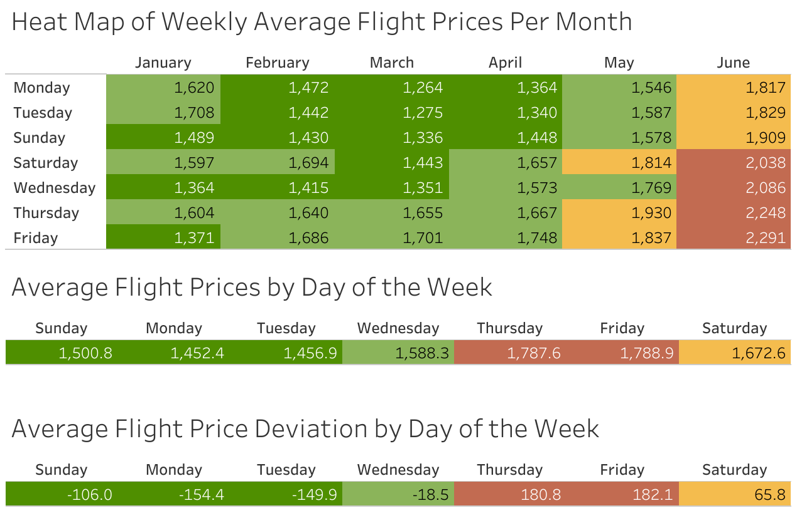
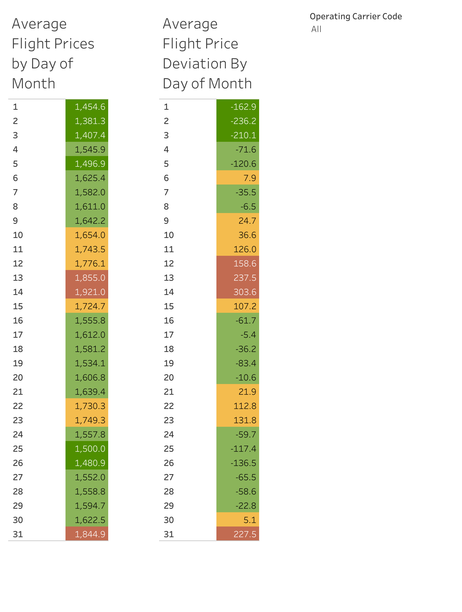
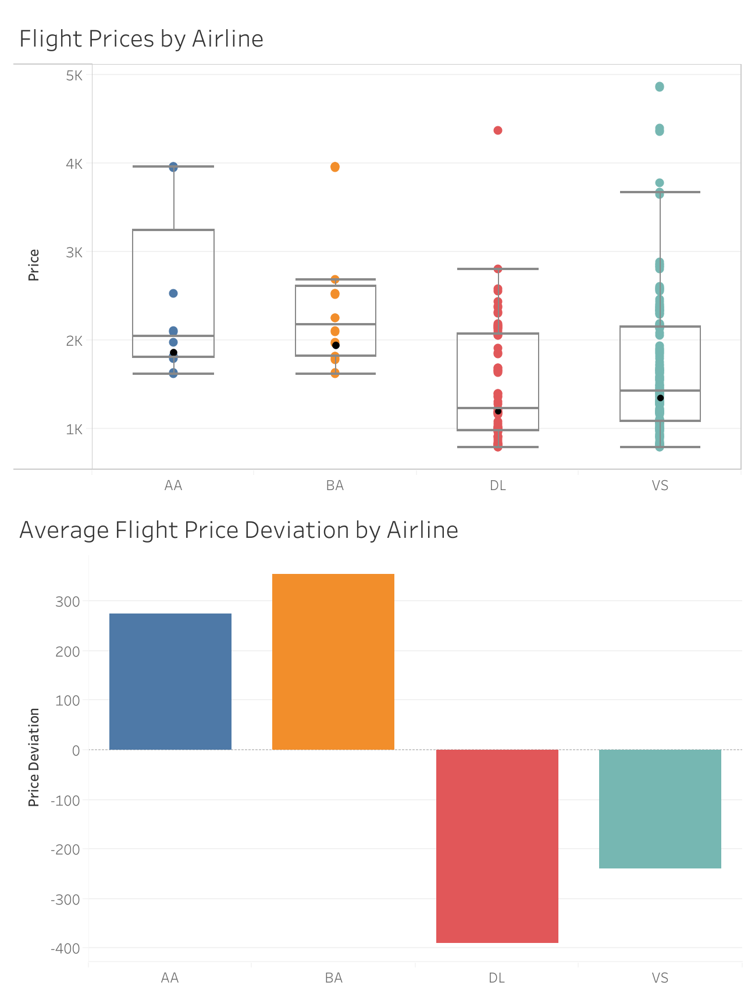
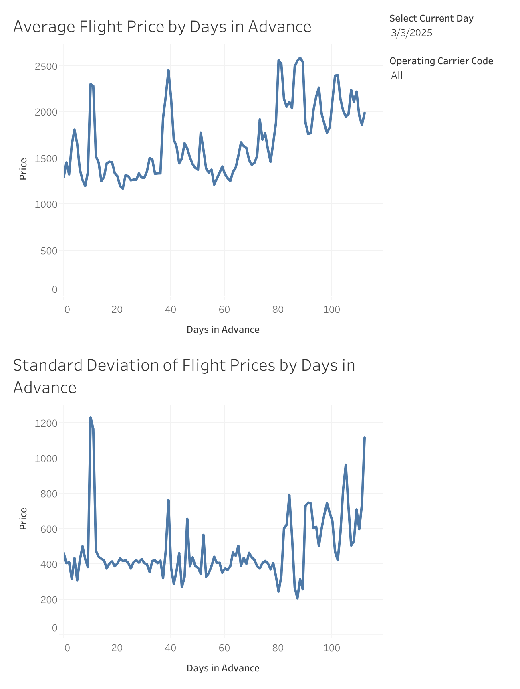
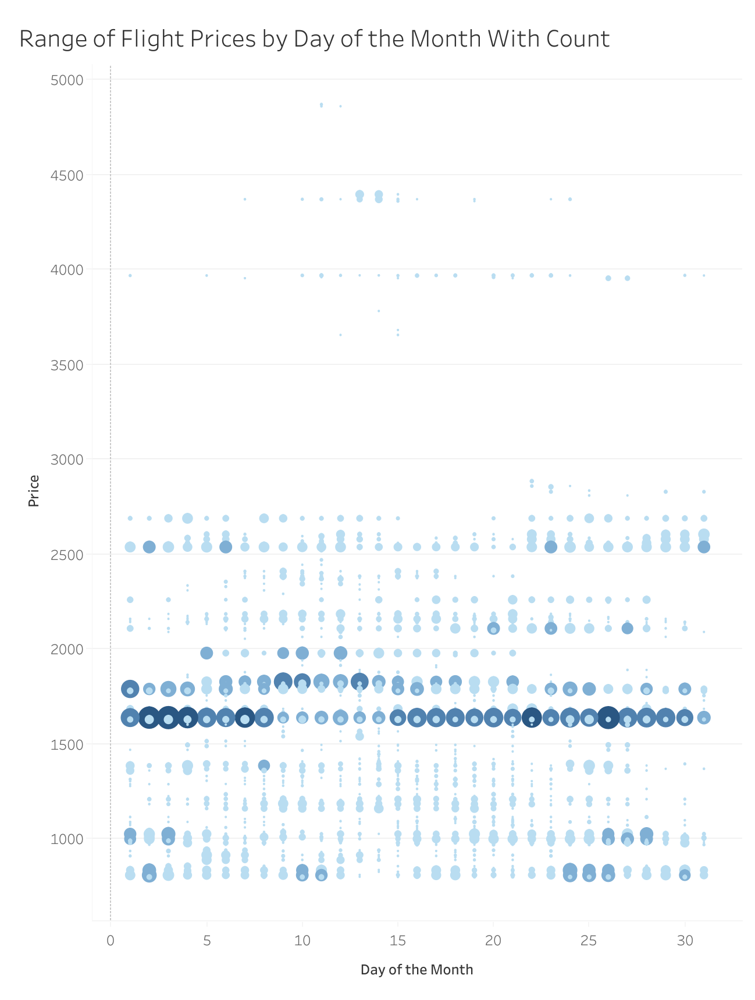

## Visualizing Flight Ticket Prices from NYC and London

### How do flight ticket prices fluctuate over time?

I've always been curious about finding the optimal time to purchase flight tickets, so I decided to collect some data on it using [Amadeus' Flight Offers API](https://developers.amadeus.com/self-service/category/flights/api-doc/flight-offers-search). Below are some visualizations of flight ticket prices of a **round trip Premium Economy** flight ticket from **New York (JFK) to London (LHR)**. Due to API restrictions, I decided to collect flight ticket prices for one flight only. I collected flight price data every 2 days for departures up to 120 days in advance. So far, I h ave collected data up until June, and will be updating this page monthly with new data for the upcoming months. 

 

If you want to interact with the visualizations, you can access them [here](https://public.tableau.com/app/profile/jeffrey.kang2292/viz/FlightVisualizer/HeatMapWeeklyAverages#1).

 
Some key takeaways:
1. *Monday* and *Tuesday* are the weekdays with the cheapest ticket prices whereas Thursday and Friday are the most expensive.
2. June is the most expensive month (unsurprisingly because of summer travel?).
3. Cheapest days to fly are early on in the month (1st, 2nd, 3rd) whereas the middle of the month (13th, 14th, 15th) and the end of the month (30th, 31st) are more expensive.
4. *Delta Airlines* offers the cheapest tickets of the 4 airlines (Delta, American, British Airways, and Virgin Atlantic). 
5. Try to avoid buying tickets 10, 40, and 90 days in advance as ticket prices have the highest price volatility on those days in advance. Buying tickets *12-20 or 50-70* days in advance seems the cheapest time to buy (closest to average ticket prices). 

---

    

 
This visualization shows:
1. Weekly averages of the flight ticket prices by month for all the data
2. Weekday averages of the flight ticket prices for all the data
3. Weekday average deviation of the flight ticket prices for all the data. In other words, how much more or less expensive are flight ticket prices for each weekday relative to a "grand average".

---

    

 
This visualization shows:
1. Daily averages of the flight ticket prices for all the data
2. Daily average deviation of the flight ticket prices for all the data. In other words, how much more or less expensive are flight ticket prices for each day relative to a "grand average".

---

    

 
These graphs show:
1. A box-and-whisker plot of the spread/distribution of ticket prices by airline with the black dot representing the mean ticket price.
2. The average flight price deviation by airline. In other words, how much more or less expensive is each airline compared to a "grand average".
Note that AA = American, BA = British Airways, DL = Delta, and VS = Virgin Atlantic

---

    

 
These line graphs show:
1. Average ticket price for all flights by the number of days in advance.
2. The standard deviation of the average ticket price for all flights by the number of days in advance. This helps visualize the price volatility of each day in advance.
Note that the current day can be adjusted in the Tableau workbook.

---

    

 
This visualization shows:
1. The spread (range) of daily flight ticket prices with the size of the circle representing the number (count) of that specific ticket price. As you can see, there seems to be a ticket price of $1,600 that appears frequently each day.

