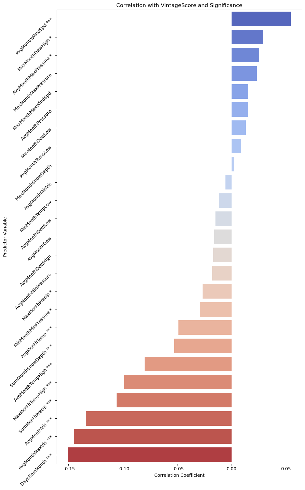

## Forecasting and Analyzing Wine Vintage Scores

[Go to Part 2 Forecasting](/pages/wine-part2)
 
[Go to Part 3 Important Features](/pages/wine-part3)

Drinking wine is one of my favorite hobbies, and I genuinely get excited each time I have a glass as I try to figure out how 'good' a wine tastes. It's fun to compare my own subjective ratings with more 'objective' vintage scores. Different organizations hand these out, and all of them in some sense score a wine based on the year it was made. 

 

Now I don't know too much about how these vintages are scored, but what I found really interesting to think about is what  makes a vintage 'good' or 'bad' in the first place? I've heard people throw around comments before like "2020 was a great year because the weather was favorable". But what does that actually mean? Unless you're a seasoned grape grower, it's hard to understand what contributes to this vintage score.

### Does weather predict wine quality?

# Outline

So my idea behind this project is to try to connect the dots and see if actual weather data can tell us something about why certain years get higher vintage scores. I'll approach this in 2 ways. First, I'll try to see if I could build a model to predict wine scores based on historical weather data. Second, I'll analyze the historical weather data and identify what factors contribute the most to wine vintage scores.

# Data

I collected wine vintage scores from [Wine Enthusiast](https://www.wineenthusiast.com/wine-vintage-chart/). The vintage score data is theoretically scored from 0 to 100. However, in the data the scores range from 81 to 100. The data covers years from 1997 to 2025 and I targeted popular wine producing countries, noting the grape/wine type by each region within that country (i.e. some regions within a country have more than one wine type). One limitation of this data is that in reality, many regions produce more than 1-3 types of wine. For instance, Napa Valley produces Syrah which is not listed on Wine Enthusiast. This means that these unlisted wines are out of the scope of this project. In the end, the dataset contained 16 regions spanning across U.S., Italy, Australia, Argentina, Chile, and France for a total of 26 unique wine-region combinations. 

 

The table below shows some descriptive statistics of the wine vintage scores.
 

<table style="border-collapse: collapse; width: 50%; margin-left: auto; margin-right: auto;">
  <tr style="border: 1px solid black;">
    <th style="border: 1px solid black; text-align: center;">Statistic</th>
    <th style="border: 1px solid black; text-align: center;">Value</th>
  </tr>
  <tr style="border: 1px solid black;">
    <td style="border: 1px solid black; text-align: center;">Mean</td>
    <td style="border: 1px solid black; text-align: center;">91.67</td>
  </tr>
  <tr style="border: 1px solid black;">
    <td style="border: 1px solid black; text-align: center;">Standard Deviation</td>
    <td style="border: 1px solid black; text-align: center;">3.27</td>
  </tr>
  <tr style="border: 1px solid black;">
    <td style="border: 1px solid black; text-align: center;">Median</td>
    <td style="border: 1px solid black; text-align: center;">92.00</td>
  </tr>
  <tr style="border: 1px solid black;">
    <td style="border: 1px solid black; text-align: center;">Minimum</td>
    <td style="border: 1px solid black; text-align: center;">81.00</td>
  </tr>
  <tr style="border: 1px solid black;">
    <td style="border: 1px solid black; text-align: center;">Maximum</td>
    <td style="border: 1px solid black; text-align: center;">100.00</td>
  </tr>
</table>

 

Correpsonding historical weather data for the same 16 regions was sourced from [WeatherSpark](https://weatherspark.com/). The site requires a paid subscription, so to download the data, I paid for a month (sad). One major limitation to note of this data is that the historical data comes from the nearest airport meteorological station. This means that the weather data location is approximate to the actual vineyard areas, so the available data reflects general weather conditions across a broader region, not the specific microclimates of individual vineyard plots. Because of this, I assume that the regional weather can serve as a proxy for the conditions affecting all listed wine types in that region. 

 

The historical weather data contains observations at the daily level, but for the purposes of my analysis, I'll be aggregating the data to the monthly level. To handle missing observations, I imputed them hierarchically: first via forward fill (using the previous month's value), then backward fill (using the next month's values), and finally using the overall mean or zero (if it made logical sense) for any remaining missing entries. To get a sense of the weather data, let's take a look at the different variables that were tracked. Since there are more than 10+ variables, and not all of them were consistently recorded, I'll present a table below showing the features that I plan to include in my modeling and analysis part.

| Variable             | Mean   | Median | Standard Deviation | Minimum | Maximum | Units |
|----------------------|--------|--------|--------------------|---------|---------|-------|
| AvgMonthTemp         | 58.07  | 56.41  | 15.47              | 28.81   | 152.80  | F     |
| AvgMonthTempLow      | 47.45  | 46.05  | 12.06              | 18.53   | 140.73  | F     |
| AvgMonthTempHigh     | 68.69  | 66.88  | 20.25              | 34.95   | 173.50  | F     |
| AvgMonthDew          | 46.23  | 46.25  | 8.62               | 18.59   | 69.46   | F     |
| AvgMonthDewLow       | 41.46  | 41.29  | 8.81               | 10.23   | 64.75   | F     |
| AvgMonthDewHigh      | 51.00  | 51.16  | 8.62               | 19.40   | 79.79   | F     |
| AvgMonthWindSpd      | 7.30   | 7.09   | 1.79               | 0.86    | 23.73   | mph   |
| AvgMonthVis          | 7.32   | 6.31   | 3.30               | 1.98    | 25.13   | mi    |
| AvgMonthMinVis       | 4.56   | 4.40   | 1.83               | 0.39    | 15.56   | mi    |
| AvgMonthMaxVis       | 10.08  | 9.77   | 6.02               | 3.28    | 40.49   | mi    |
| AvgMonthPressure     | 30.03  | 30.01  | 0.17               | 28.95   | 34.78   | Hg    |
| AvgMonthMinPressure  | 29.95  | 29.94  | 0.14               | 27.30   | 30.42   | Hg    |
| AvgMonthMaxPressure  | 30.11  | 30.08  | 0.29               | 29.72   | 39.75   | Hg    |
| MaxMonthTempHigh     | 84.38  | 80.60  | 25.95              | 42.80   | 206.60  | F     |
| MaxMonthDewHigh      | 60.71  | 60.08  | 11.57              | 19.40   | 210.20  | F     |
| MaxMonthMaxWindSpd   | 26.21  | 24.17  | 13.04              | 3.45    | 391.26  | mph   |
| MaxMonthMaxPressure  | 30.73  | 30.35  | 7.46               | 29.98   | 295.27  | Hg    |
| MaxMonthSnowDepth    | 0.66   | 0.00   | 4.03               | 0.00    | 92.52   | in    |
| MaxMonthPrecip       | 0.34   | 0.05   | 0.58               | 0.00    | 6.05    | in    |
| MinMonthTempLow      | 36.33  | 35.60  | 11.16              | -5.80   | 68.00   | F     |
| MinMonthDewLow       | 26.73  | 28.04  | 14.53              | -142.60 | 55.40   | F     |
| MinMonthMinPressure  | 29.46  | 29.62  | 1.84               | 0.00    | 30.21   | Hg    |
| SumMonthPrecip       | 0.88   | 0.00   | 2.08               | 0.00    | 17.99   | in    |
| SumMonthSnowDepth    | 0.18   | 0.00   | 2.81               | 0.00    | 92.52   | in    |
| DaysRainMonth        | 3.72   | 0.00   | 6.18               | 0.00    | 30.00   | days  |

#### Basic Descriptives

Let's also explore the data a bit more by looking at how VintageScores changes based on wine type.

| WineType              | Mean VintageScore |
|-----------------------|-------------------|
| Amarone               | 90.62          |
| Barolo                | 94.05          |
| Bolgheri              | 91.42          |
| Cabernet Sauvignon    | 91.86          |
| Chablis               | 93.04          |
| Chardonnay            | 91.18          |
| Chenin Blanc          | 92.00          |
| Chianti               | 91.62          |
| Gamay                 | 91.38          |
| Gewurztraminer        | 91.27          |
| Merlot                | 93.00          |
| Pinot Noir            | 91.95          |
| Semillon              | 92.54          |
| Soave                 | 90.15          |
| Syrah                 | 92.79          |
| Zinfandel             | 90.04          |

 

It's also interesting to look at the highest VintageScores given to each wine.

| WineType              | Max VintageScore |
|-----------------------|------------------|
| Amarone               | 94         |
| Barolo                | 99         |
| Bolgheri              | 97         |
| Cabernet Sauvignon    | 100         |
| Chablis               | 96         |
| Chardonnay            | 96         |
| Chenin Blanc          | 96         |
| Chianti               | 96         |
| Gamay                 | 96         |
| Gewurztraminer        | 95         |
| Merlot                | 98         |
| Pinot Noir            | 98         |
| Semillon              | 96         |
| Soave                 | 94         |
| Syrah                 | 99         |
| Zinfandel             | 94         |

 

Finally, how does VintageScore vary based on the year?

| Year | Mean VintageScore |
|------|-------------------|
| 1998 | 88.91          |
| 1999 | 89.41          |
| 2000 | 88.23          |
| 2001 | 91.86          |
| 2002 | 88.62          |
| 2003 | 88.90          |
| 2004 | 91.04          |
| 2005 | 92.17          |
| 2006 | 90.13          |
| 2007 | 91.61          |
| 2008 | 90.74          |
| 2009 | 92.94          |
| 2010 | 93.09          |
| 2011 | 91.09          |
| 2012 | 92.23          |
| 2013 | 91.64          |
| 2014 | 91.91          |
| 2015 | 93.95          |
| 2016 | 93.91          |
| 2017 | 92.04          |
| 2018 | 92.78          |
| 2019 | 93.91          |
| 2020 | 92.09          |
| 2021 | 93.26          |
| 2022 | 92.87          |
| 2023 | 93.35          |

 

A useful plot that I always like to perform is a correlation heatmap of my predictor variables of interest with the main dependent variable, VintageScore.

    

 

The variables that had a significant correlation with VintageScore are denoted with the \*, \*\*, or \*\*\*, representing significance at the <0.05, <0.01, or <0.001 level respectively.

 

Interestingly, we see that AvgMonthWindSpd, or the average monthly wind speed, is positively related to VintageScore. This means that the higher the monthly wind speed, the higher the vintage score. While I know nothing about growing vines, this may seem quite counter-intuitive because the higher the wind speed, the more potential damage to the grape vines. However, some quick research suggests that more wind could act as a proxy for good air circulation, which benefits the grape vines by drying them (preventing damp conditions) and moderating temperatures.

 

We also see that DaysRainMonth, so the number of days where it rained in that month, is negatively associated with VintageScore. This means that the more that it rained in a month, the lower the VintageScore. This could make sense because too much rain could mean that 1) the grape vines have more susceptibility to diseases (moisture for fungal spores) and 2) less sunny days so less photosynthesis.

 

So next, we'll move onto building a time series model that can potentially predict vintage scores!

[Go to Part 2 Forecasting](/pages/wine-part2)

 

[Go to Part 3 Important Features](/pages/wine-part3)

